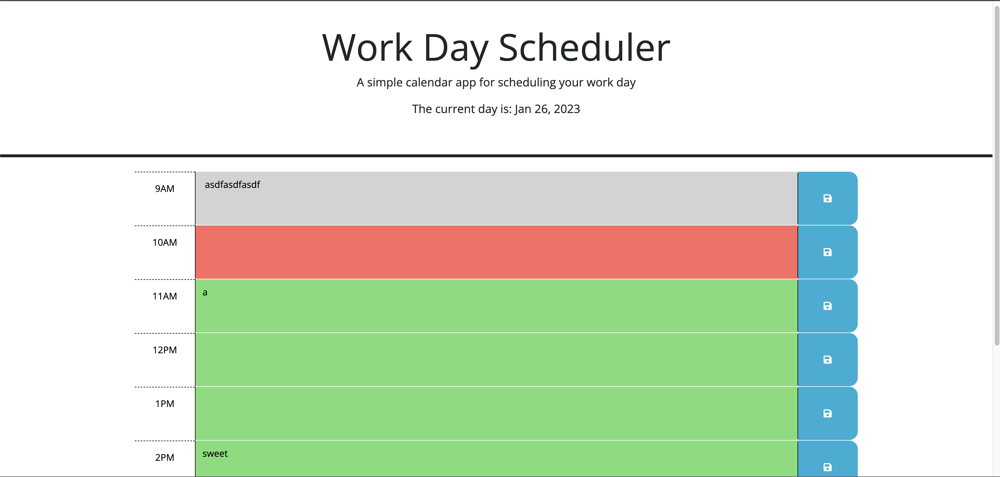
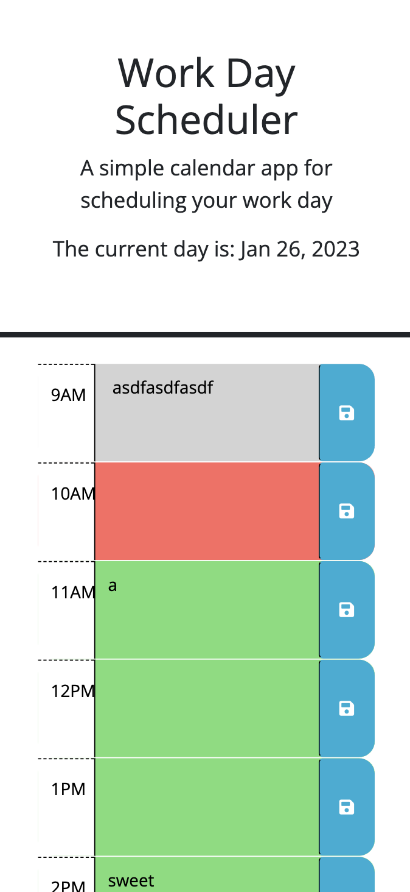

# 05 Third-Party APIs: Work Day Scheduler

## Description
My motivation for making refactoring this webpage was to practice my skills using jQuery and the WebAPI. I furthered my understanding of using functions as I incorporated the use of the WebAPI and jQuery in my functions to update the page as the user took certain actions. Specifically I learned how to better maneuver in the DOM using jQuery, update styling by adding classes or ids usint the WebAPI.

I also will be adding this to my portfolio from assignment 2. I'm looking forward to continue to learn more about server side API's and getting proficient with Boostrap and jQuery. 

## Deployment
<a href="https://john-abou.github.io/work-scheduler">Webpage link</a>

## Usage
The webpage has been made for anyone who would like to plan their workday. In the morning you can hop on to the web page, make a to do list for each hour of your work day and save it so you can review it thorughout the day. 

### Desktop webpage screenshot
* <b>Start page on desktop</b>
 

### Mobile webpage screenshot
* <b>Start page on Mobile</b>  
 

## Credits
Credits to the discord group for working together to figure out some of the trickier though processes. Also, never forget the MVP's of learning -- stack overflow and google.

## License
This webpage has been made commercially available under the MIT license.

- - -
© Copyright. john-abou. The one piece is real 🏴‍☠
